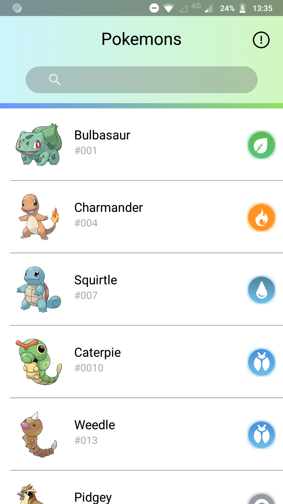
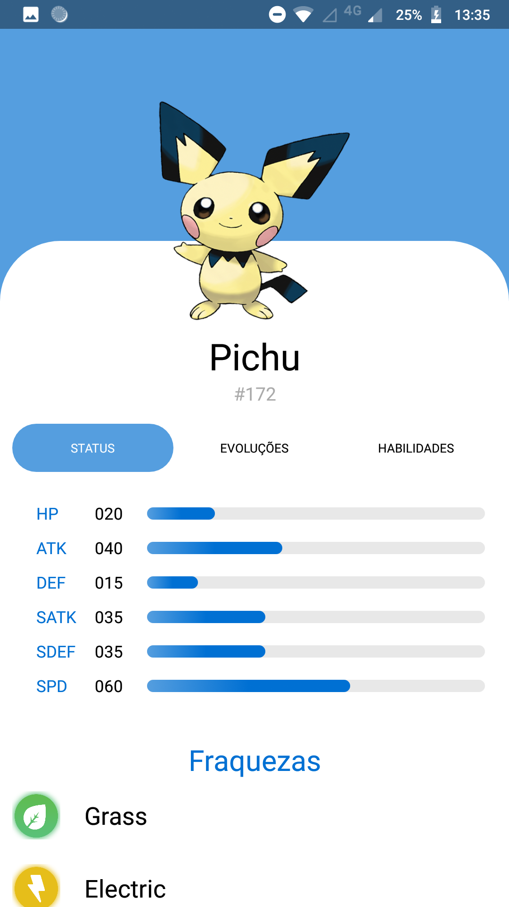

# Pokédex - Projeto integrador do programa Afrodev 1ª Edição

## Créditos
O protópito do projeto integrador foi desenvolvido pela Desenvolvedora mobile [Sandyara Peres].
Todo o protótipo você pode ver no repositório: [Projeto Integrador]

## Screenshots

Landing                                  |  Pokemon Listing Page                         |  Pokemon Page
:---------------------------------------:|:---------------------------------------------:|:---------------------------------------------:
  |   |  

## Objetivo
Essa pokédex está sendo desenvolvida com intuito de agregar o maior número de conhecimentos relacionados a desenvolvimento android. 
Dessa forma, estaremos apto a enfrentar a maioria dos desafios que o mercado nos propõe.

## Linguagens e ferramentas
Toda a aplicação é desenvolvida em Kotlin. Os dados são consumídos da api [PokeAPI]

## Utilização
Para utilizar o projeto, você só precisa abri-lo pelo Android Studio e rodar em um emulador ou dispositivo android físico.

## Autor

| [ @gsesdras](https://github.com/gsesdras) |
|:---:|

[Sandyara Peres]: https://www.linkedin.com/in/sandyaraperes/
[Projeto Integrador]: https://github.com/SandyaraPeres/afrodev-android/
[PokeAPI]: https://pokeapi.co/
